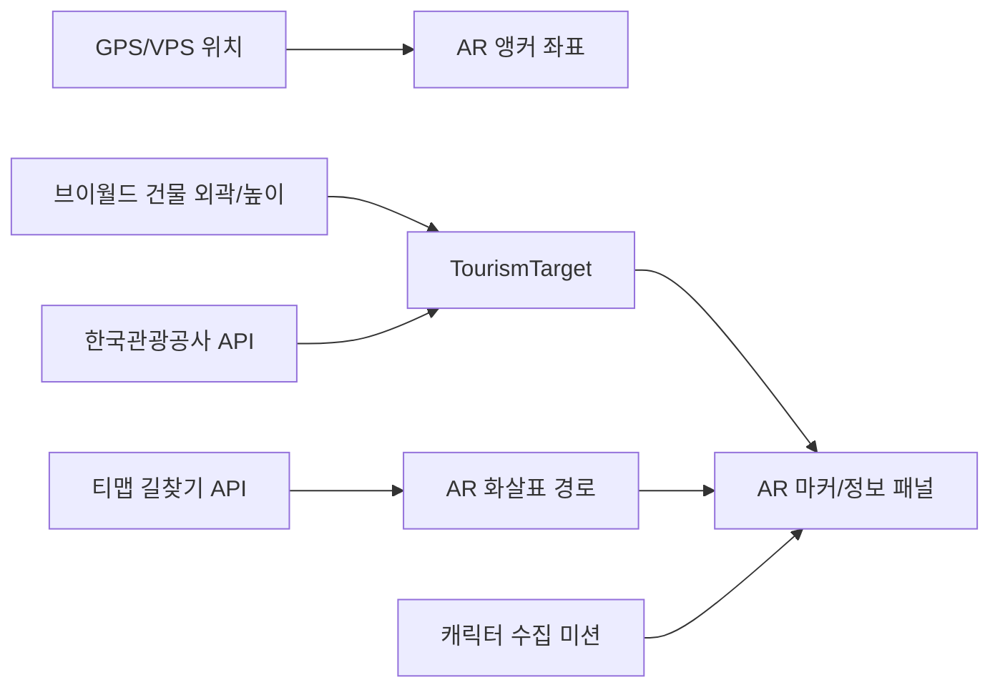

# 부산 AR 관광 정보 앱 현재 상황 및 하네스 엔지니어링

## 문서 운영 규칙

- 이 스레드는 PM/기획/조율 전용이다.
- 이 스레드에서는 `.md` 문서 외의 코드/설정 파일을 수정하지 않는다.
- 프론트엔드, 백엔드, 네이티브, 테스트 구현은 별도 스레드에 문서 기반으로 지시한다.
- 이 문서는 항상 200줄 미만으로 유지한다.
- 큰 로직 수정이 있을 때마다 "최근 업데이트"와 관련 섹션을 짧게 갱신한다.
- 상세 구현 순서와 작업 상태는 `doc/implement-plan.md`를 기준으로 관리한다.
- 컨텍스트 압축 이후에는 이 문서와 `implement-plan.md`를 먼저 읽고 현재 방향을 복원한다.

## 목적

React Native(TypeScript) 기반 모바일 앱에서 AR을 활용해 부산 지역 관광지 정보를 제공한다.

- 바다, 공원 같은 비실체화 공간은 대표 위치 또는 영역 중심에 AR 마커를 배치한다.
- 맛집, 쇼핑몰, 랜드마크 같은 건물형 관광지는 브이월드 건물 외곽 좌표와 높이 정보를 활용해 실제 건물 위치에 맞춰 표시한다.
- 사용자 위치에서 관광지까지 AR 공간에 방향 화살표를 만들어 길찾기를 제공한다.
- 부산 캐릭터 수집 미션을 붙여 사용자의 탐색 동기를 만든다.

## 현재 상태

- 앱 위치: `mobile`
- 스택: React Native 0.83, TypeScript, `react-native-config`, `react-native-geolocation-service`, `@reactvision/react-viro`
- VPS: API 키 발급 완료, `VPSARView` 네이티브 브릿지 방향으로 전환 중
- 브이월드: 주소 입력 후 건물 외벽 좌표 조회를 확인했고, 현재 서비스 코드에 주소 검색/WFS/GIS건물통합정보 로직이 있다.
- 테스트 하네스: Jest 설정과 `vworldBuildingService` 순수 로직 테스트를 추가했다.
- 현재 초점: 실제 기기 테스트 전, VPS 위치 정교화와 카메라 방향 기반 건물 정보 조회를 테스트 코드로 빠르게 검증하는 단계.

## 구현 우선순위

1. VPS로 내 위치를 정교화하고, 브이월드로 카메라가 바라보는 건물/관광지를 이해한다.
2. 내 위치부터 원하는 관광지까지 AR 길안내를 제공한다.
3. 사용자 친화적인 UI/UX로 정리한다.

현재는 1번을 진행 중이다. 간단 UI로 수동 테스트하던 방식에서, 실제 기기 테스트가 필요한 영역을 제외한 로직은 테스트 코드와 fixture로 검증하는 방식으로 전환한다.

## 주요 파일

- `App.tsx`: 권한, 위치 조회, 대상 입력, 브이월드 조회, AR 실행 UI가 모여 있다.
- `src/services/vworldBuildingService.ts`: 주소 지오코딩, WFS 건물 피처 선택, 폴리곤 추출, 내부/외부 판정, GIS건물통합정보 XML 파싱.
- `src/ar/ARMapScene.tsx`: Viro 기반 AR 마커 배치와 카메라 시야 판정 로직.
- `src/ar/VPSARView.tsx`: 네이티브 VPS AR View 브릿지.
- `__tests__/vworldBuildingService.test.ts`: 주소 파싱, bbox 생성, 건물 선택, 폴리곤 판정 테스트.

## 핵심 아키텍처 방향

권장 분리는 다음과 같다.

- 데이터 계층: 브이월드, 한국관광공사, 티맵, Supabase 선택 도입
- 도메인 계층: 관광지 모델, 건물 폴리곤, 거리/방위각, 경로 세그먼트, 미션 상태
- AR 계층: GPS/VPS 위치를 AR 앵커로 변환하고 마커/화살표를 렌더링
- 하네스 계층: fixture, 순수 함수 테스트, API 계약 테스트, 위치 시뮬레이션

## 하네스 엔지니어링 방향

실제 카메라, 실제 위치, 실제 외부 API 없이도 핵심 로직을 반복 검증할 수 있어야 한다.

우선 테스트할 항목:

- VPS 결과를 앱 내부 위치 모델로 정규화
- 사용자 위치와 카메라 heading/ray를 이용한 후보 건물 선택
- 주소 파싱, bbox 생성, 건물 피처 선택
- 폴리곤 내부/외부 판정
- 위경도와 고도를 AR 월드 좌표로 변환
- 거리와 방위각 계산
- 브이월드/한국관광공사/티맵 응답 fixture 기반 mapper 검증
- 경로 polyline을 AR 화살표 anchor로 변환

검증 명령:

- `pnpm exec jest --runInBand`
- `pnpm exec tsc --noEmit`
- `pnpm exec eslint src/services/vworldBuildingService.ts __tests__/vworldBuildingService.test.ts`

## 정리 후보

- `mobile-rn85-backup`: 백업 프로젝트로 보이며 현재 앱과 혼동 가능성이 있다. 보관 목적이면 별도 archive 또는 브랜치로 분리한다.
- `.pnpm-store`, `.DS_Store`: 로컬 생성물이므로 `.gitignore` 관리 대상이다.
- `App.tsx`: 권한, 위치, 폼, API 호출, AR 상태가 한 파일에 섞여 있어 기능 단위 분리가 필요하다.
- Viro와 `VPSARView` 병존: 최종 AR 방향을 정한 뒤 의존 범위를 정리한다.
- `src/services/vworld.ts`: 미구현 placeholder를 명확한 interface와 fixture 기반 구현으로 교체한다.

## 최근 업데이트

- 2026-05-17: 구현 우선순위를 VPS/브이월드 건물 인식, AR 길안내, UI/UX 순서로 확정했다.
- 2026-05-17: 현재 1단계의 검증 목표를 "VPS 동작 확인"과 "카메라가 바라보는 건물 정보 조회 확인"으로 명시했다.
- 2026-05-17: 이 스레드를 PM 전용으로 고정하고 `.md` 외 코드 수정 금지 원칙을 추가했다.
- 2026-05-17: 문서 운영 규칙을 추가하고 200줄 미만 유지 방침을 확정했다.
- 2026-05-17: `doc/implement-plan.md`를 별도 실행 계획 문서로 분리했다.
- 2026-05-17: Jest 하네스, 브이월드 순수 로직 테스트, bbox 좌표 포맷 정규화, JSON 응답 타입 보정을 추가했다.
